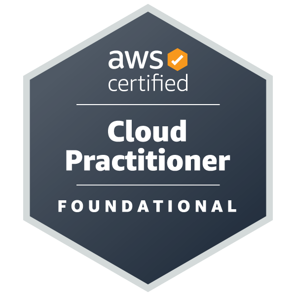
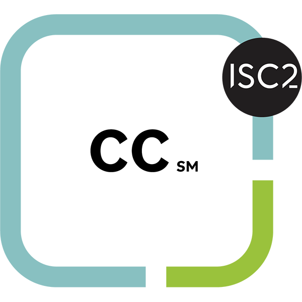

#  Hello, I'm Alvin Janton

#### Connect

  
  

---

## About Me

**Pursuing a BS in Cybersecurity at Florida International University. Class of 2027**

I'm a cybersecurity and cloud security learner focused on building hands-on projects that connect security operations, AWS infrastructure, DevOps automation, and secure application development.

**Current focus:** cloud security engineering, threat hunting, secure Java application design, AWS infrastructure, and AI-assisted engineering workflows.

---

## Featured Projects

### [LaxPass](https://github.com/Alvin-Janton/PasswordManager18)
**Solo security engineering project**

*A Java Swing desktop password manager built around encrypted vault storage, optional TOTP-based 2FA, recovery flows, local/S3 backups, and AWS-side hardening for the cloud backup path.*

* **Tech Stack:**      
* **Impact:** Built a security-focused desktop application with vault integrity checks, atomic vault rewrites, recovery-code workflows, sensitive clipboard handling, scheduled backups, and least-privilege cloud backup infrastructure.

---

### [IAM Argus Security Dashboard](https://github.com/AWS-IAM-Dashboard/IAM-Dashboard)
**Backend & infrastructure contributor**

*A cloud security dashboard that centralizes AWS security posture, vulnerability scanning, findings, ticketing, and triage workflows for security teams.*

* **Tech Stack:**       
* **Impact:** Implemented backend and infrastructure features including BFF authentication for the frontend, RBAC with JWT validation and DynamoDB-backed storage, and multi-account IAM scanning through Lambda, IAM, and DynamoDB.

---

### [Threat-Hunting Projects](https://github.com/Alvin-Janton/Threat-Hunting)
**Solo SOC and DFIR investigation portfolio**

*A hands-on threat-hunting repository simulating real incident response workflows across AWS CloudTrail analysis, Splunk IOC correlation, and Catalyst incident reconstruction.*

* **Tech Stack:**      
* **Impact:** Produced SOC-style deliverables including parsing scripts, enriched datasets, IOC pivots, Splunk searches, dashboards, incident reports, attack-flow diagrams, and structured triage documentation.
---

## Tech Stack

### Cloud & Security

### DevOps & Tools

### Languages & Development

### Data & Analysis

---

## Certifications

<table align="left" width="100%">
  <tr>
    <td align="center" width="25%">
      <a href="https://www.credly.com/earner/earned/badge/8f439f66-a938-40cb-88e0-7843d89871c9" style="text-decoration: none;">
        
         <b>Security+</b>
      </a>
    </td>
    <td align="center" width="25%">
      <a href="https://www.credly.com/badges/58571b6d-a685-4e2f-ad27-305c8eab2a7f/public_url" style="text-decoration: none;">
        
         <b>AWS Cloud Practitioner</b>
      </a>
    </td>
    <td align="center" width="25%">
      <a href="https://www.credly.com/earner/earned/badge/a2639211-1e38-4a52-95a7-f6d03bbcb075" style="text-decoration: none;">
        
         <b>ISC2 CC</b>
      </a>
    </td>
    <td align="center" width="25%">
      <a href="https://www.credly.com/earner/earned/badge/f6533902-6dfb-48b6-b96a-b492bb9a113a" style="text-decoration: none;">
        
         <b>Google Cybersecurity Certificate</b>
      </a>
    </td>
  </tr>
</table>
 

---

## GitHub Stats

<table>
  <tr>
    <td align="center" valign="top">
      
    </td>
    <td align="center" valign="top">
      <picture>
        <source srcset="https://github.com/Alvin-Janton/github-stats/blob/generated/languages.svg#gh-dark-mode-only" media="(prefers-color-scheme: dark)" />
        <source srcset="https://github.com/Alvin-Janton/github-stats/blob/generated/languages.svg#gh-light-mode-only" media="(prefers-color-scheme: light), (prefers-color-scheme: no-preference)" />
        
      </picture>
    </td>
  </tr>
</table>

<table>
  <tr>
    <td align="center">
      <picture>
        <source srcset="Icons/github-contribution-grid-snake-dark.svg" media="(prefers-color-scheme: dark)" />
        <source srcset="Icons/github-contribution-grid-snake.svg" media="(prefers-color-scheme: light), (prefers-color-scheme: no-preference)" />
        
      </picture>
    </td>
  </tr>
</table>

[Created by `jstrieb/github-stats`.](https://github.com/jstrieb/github-stats)

